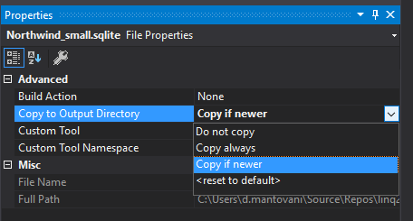

# Linq2db sample
* https://github.com/linq2db/linq2db
* https://linq2db.github.io/index.html

## Setup
* Referenziare il pacchetto nuget linq2db.Core
* Referenziare il pacchetto nuget Microsoft.Data.SQLite
* Referenziare il pacchetto nuget Newtonsoft.Json
* Scaricare il file https://github.com/jpwhite3/northwind-SQLite3/blob/master/Northwind_small.sqlite e aggiungerlo al progetto. 
* Modificare le proprietà del file <code>Northwind_small.sqlite</code> come segue:

## Amministrare il db sqlite
* http://www.sqliteexpert.com/download.html (Personal Edition)
* https://marketplace.visualstudio.com/items?itemName=ErikEJ.SQLServerCompactSQLiteToolbox

## Generare le classi (modello) C# a partire dallo schema di un db esistente
* https://github.com/linq2db/t4models
